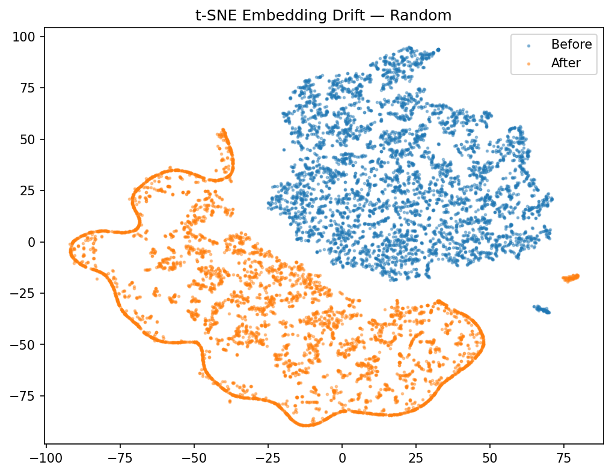
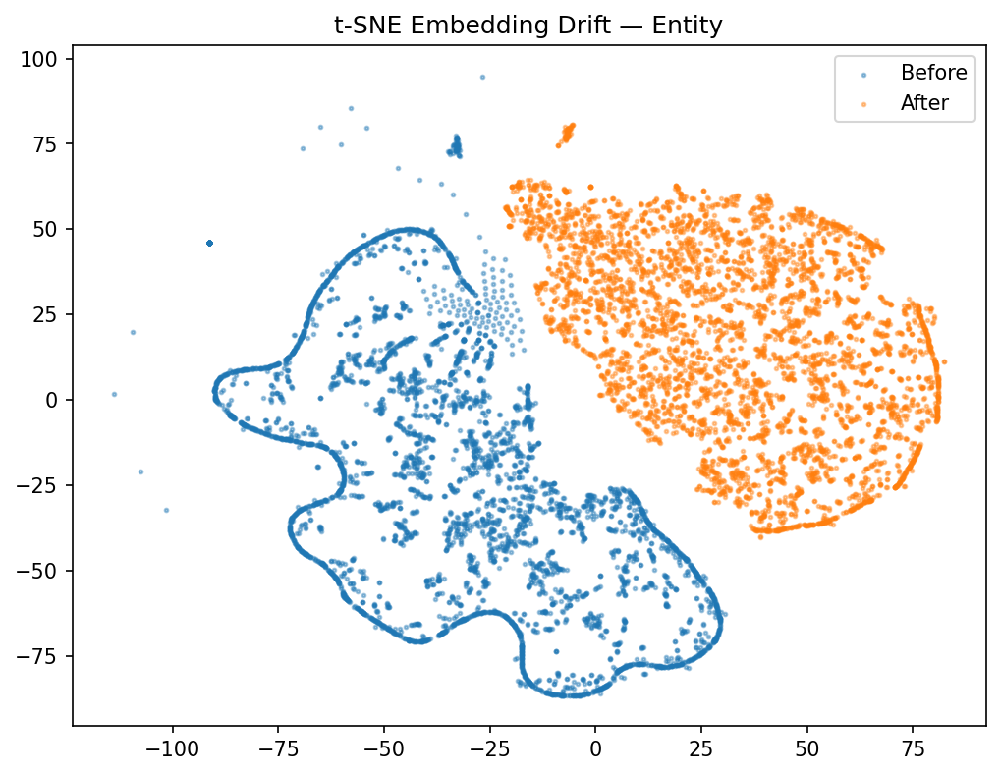
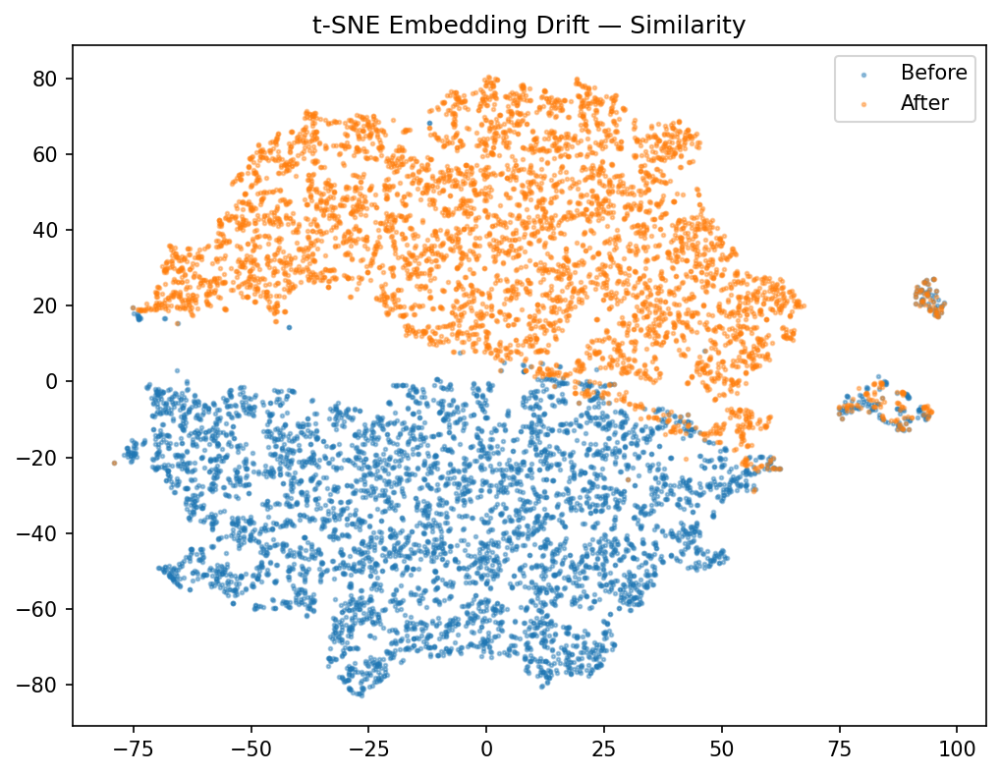
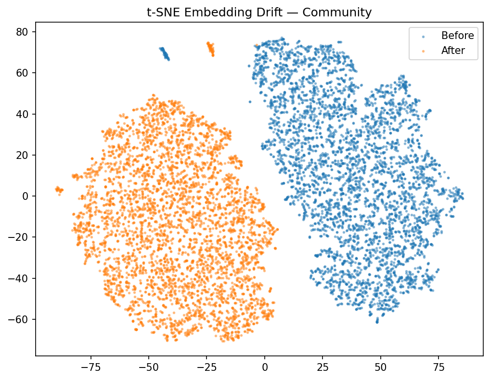
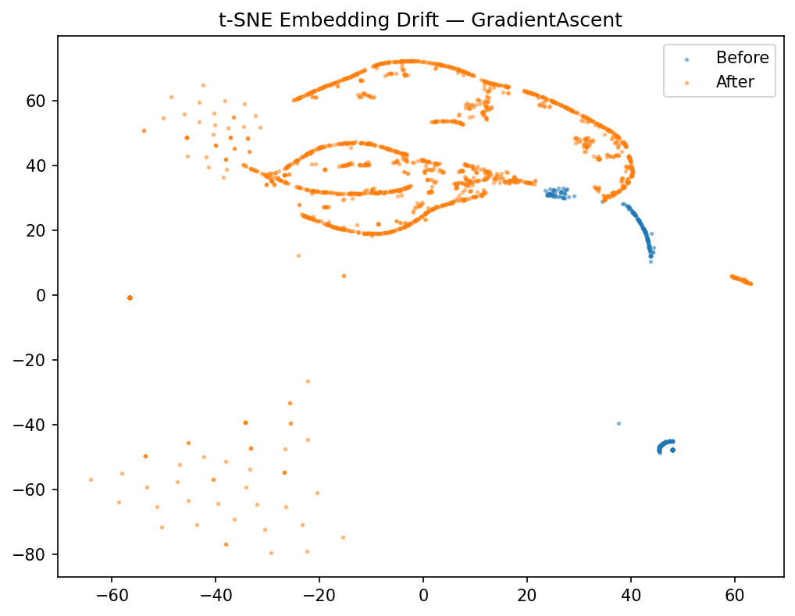
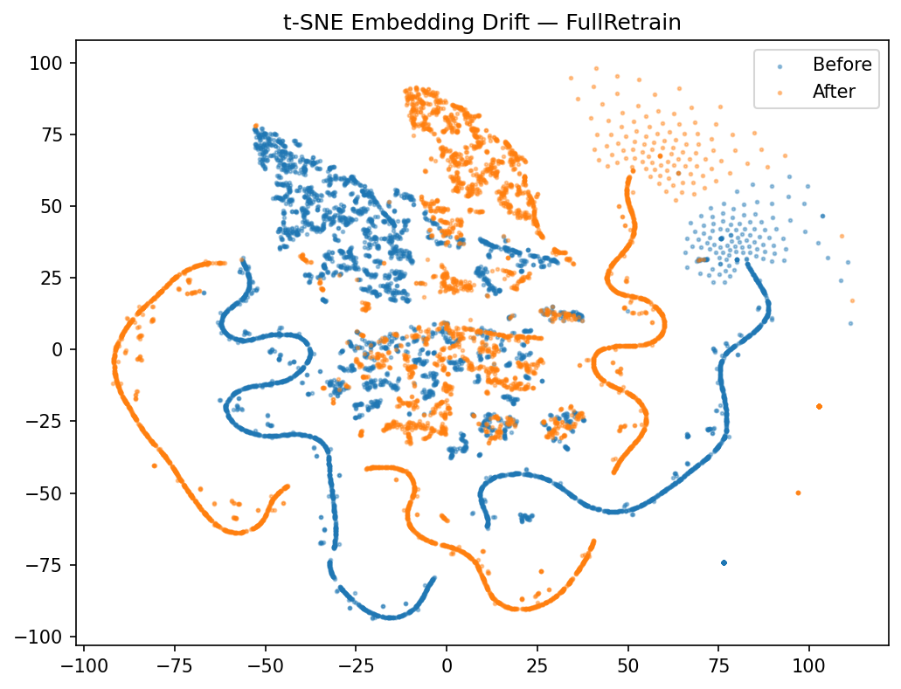

# EUBG: Edge Unlearning in Bipartite Graphs

This repository contains the official implementation of **EUBG** (Edge Unlearning in Bipartite Graphs), a framework for machine unlearning in drug-target interaction (DTI) networks. The framework enables verifiable removal of individual edges from a trained graph neural network while preserving overall model utility.

<p align="center">
  
</p>

## Overview

Graph-based drug-target interaction prediction models raise significant privacy and regulatory concerns when trained on sensitive biomedical data. EUBG addresses the right-to-be-forgotten by providing verifiable, auditable edge deletion from trained GNN models. The framework implements and benchmarks six unlearning strategies across four SISA-based sharding methods and two global baselines, evaluating them on a comprehensive metrics suite that measures both model utility and forgetting quality.

The accompanying paper is available at [`EUBG.pdf`](EUBG.pdf).

## Repository Structure

```
EUBG/
├── README.md
├── EUBG.pdf                          # Paper
├── image.png                         # Framework diagram
├── requirements.txt                  # Python dependencies
│
├── data/                             # Dataset files
│   ├── KiBA_final_after_fp_clean.xlsx
│   ├── drug_morgan_fingerprints_after_fp_clean.csv
│   ├── drug_smiles_kiba_final_after_fp_clean.csv
│   └── kiba_edges_balanced.csv
│
└── src/                              # Source code
    ├── config.py                     # Hyperparameters, paths, and constants
    ├── data_loader.py                # Data loading and negative sampling
    ├── model.py                      # GraphSAGE encoder + link predictor
    │
    ├── base_shard.py                 # Abstract base class for SISA sharding
    ├── random_shard.py               # Random sharding strategy
    ├── entity_shard.py               # Entity (index-range) sharding strategy
    ├── similarity_shard.py           # Similarity (fingerprint clustering) sharding
    ├── community_shard.py            # Community (Louvain) sharding strategy
    │
    ├── gradient_ascent.py            # Gradient ascent unlearning (non-SISA)
    ├── full_retrain.py               # Full retraining baseline (gold standard)
    ├── unlearn.py                    # Unlearning with SHA-256 verification
    │
    ├── metrics.py                    # Evaluation metrics and t-SNE visualization
    ├── evaluate_all.py               # End-to-end evaluation runner
    ├── smoke_test.py                 # Quick pipeline validation
    │
    └── results/
        ├── certificates/             # SHA-256 unlearning verification records
        │   └── {strategy}/cert_*.json
        └── plots/                    # t-SNE embedding drift visualizations
            └── tsne_{Strategy}.png
```

## Dataset

EUBG uses the **KiBA** (Kinase Inhibitor BioActivity) dataset for drug-target interaction prediction. The bipartite graph consists of:

| Property         | Value   |
|------------------|---------|
| Drug nodes       | 52,477  |
| Protein nodes    | 467     |
| Total nodes      | 52,944  |
| Positive edges   | 59,852  |
| Total edges      | 119,704 |
| Feature dimension| 2,048   |

Drug node features are derived from 2048-bit Morgan molecular fingerprints. Edges represent known drug-target interactions from the KiBA bioactivity database, balanced with negative sampling.

## Method

### Model Architecture

EUBG employs a two-layer **GraphSAGE** encoder for node representation learning. The encoder computes node embeddings via neighborhood aggregation over the full bipartite graph. Link prediction scores are obtained through dot-product decoding of source and target node embeddings, trained with binary cross-entropy loss.

### Unlearning Strategies

The framework implements six unlearning strategies organized into two categories:

**SISA-based sharding strategies** partition drug nodes into *K* shards. Each shard maintains an independent model trained on its local edges while using the global graph for message passing. Unlearning an edge requires retraining only the affected shard.

| Strategy      | Partitioning Method                                              |
|---------------|------------------------------------------------------------------|
| Random        | Uniform random assignment via permutation                        |
| Entity        | Contiguous index-range bucketing                                 |
| Similarity    | TruncatedSVD on Morgan fingerprints followed by KMeans clustering|
| Community     | Louvain community detection with balanced merging/splitting      |

**Global baselines** operate on a single model without sharding:

| Strategy         | Unlearning Method                                                               |
|------------------|---------------------------------------------------------------------------------|
| Gradient Ascent  | Negated BCE loss on forgotten edges with gradient clipping and utility monitoring|
| Full Retrain     | Complete retraining from scratch after edge removal (gold standard)              |

### Unlearning Verification

Each edge deletion produces a verification record containing SHA-256 hashes of model weights before and after unlearning, enabling third-party verification that the model state has changed in response to a deletion request.

## Evaluation Metrics

| Metric              | Description                                                            | Desired Direction |
|---------------------|------------------------------------------------------------------------|-------------------|
| AUROC               | Area under the ROC curve on test edges                                 | Higher is better  |
| F1                  | F1 score at threshold 0.5                                              | Higher is better  |
| MIA AUC             | Membership inference attack AUC (logistic regression adversary)        | Closer to 0.5     |
| DDRT                | Deleted data retention test accuracy                                   | Lower is better   |
| KL Divergence       | Distribution shift in prediction scores before vs. after unlearning    | Lower is better   |
| Forgetting Score    | Composite metric: (1/3)(MIA term) + (1/3)(1 - DDRT) + (1/3)exp(-KL)  | Higher is better  |
| Embedding Drift     | Average L2 norm of per-node embedding change                          | --                |

## Results

### t-SNE Embedding Drift Visualizations

The following t-SNE plots illustrate the embedding space before (blue) and after (orange) unlearning for each strategy. Minimal drift indicates that the model structure is preserved while the target edges are forgotten.

<p align="center">
  
  
</p>
<p align="center">
  
  
</p>
<p align="center">
  
  
</p>

## Installation

### Requirements

- Python 3.8+
- CUDA-compatible GPU (recommended)

```bash
git clone https://github.com/akashmadisetty/EUBG.git
cd EUBG
pip install -r requirements.txt
```

## Usage

### Quick Smoke Test

Validate the pipeline with reduced parameters (3 shards, 3 epochs, 5 deletions):

```bash
cd src
python smoke_test.py
```

### Full Evaluation

Run the complete evaluation across all six strategies:

```bash
cd src
python evaluate_all.py
```

This will:
1. Load and preprocess the KiBA dataset
2. Train each strategy (sharding + model training)
3. Evaluate link prediction performance (AUROC, F1)
4. Execute certified unlearning on 100 benchmark deletions
5. Compute privacy and forgetting metrics (MIA, DDRT, KL, Forgetting Score)
6. Generate t-SNE visualizations and SHA-256 verification records
7. Print an IEEE-style summary table and save results to `src/results/`

### Configuration

All hyperparameters are centralized in `src/config.py`:

| Parameter           | Default | Description                          |
|---------------------|---------|--------------------------------------|
| `HIDDEN_DIM`        | 128     | GNN hidden layer dimension           |
| `NUM_GNN_LAYERS`    | 2       | Number of GraphSAGE layers           |
| `LEARNING_RATE`     | 0.01    | Training learning rate               |
| `EPOCHS`            | 200     | Maximum training epochs              |
| `PATIENCE`          | 20      | Early stopping patience              |
| `K_SHARDS`          | 20      | Number of SISA shards                |
| `NUM_BENCHMARK_DELETIONS` | 100 | Edges sampled for unlearning       |
| `GA_STEPS`          | 10      | Gradient ascent steps                |
| `GA_LR`             | 0.0005  | Gradient ascent learning rate        |

## Citation

If you use this code in your research, please cite:

```bibtex
@article{eubg2025,
  title={EUBG: Edge Unlearning in Bipartite Graphs},
  year={2025}
}
```

## License

This project is released for academic and research purposes.
